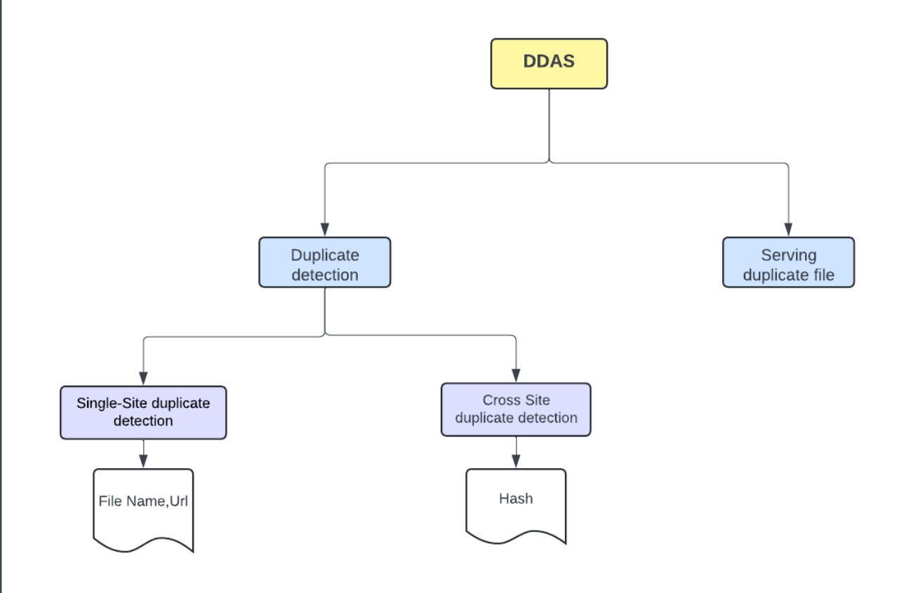
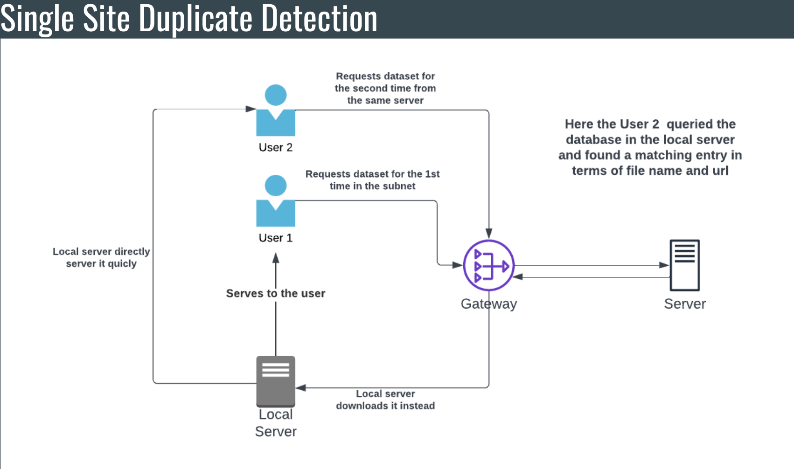
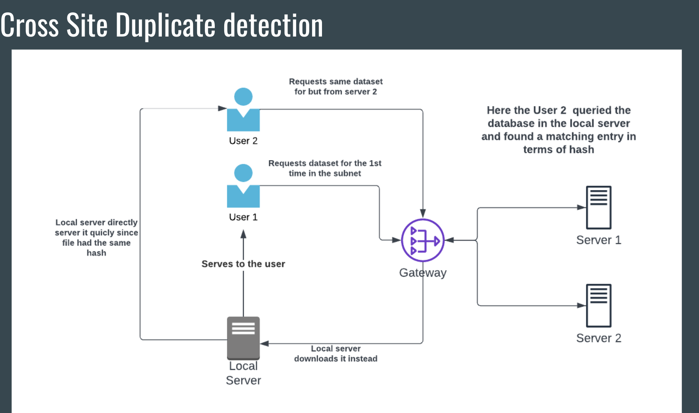
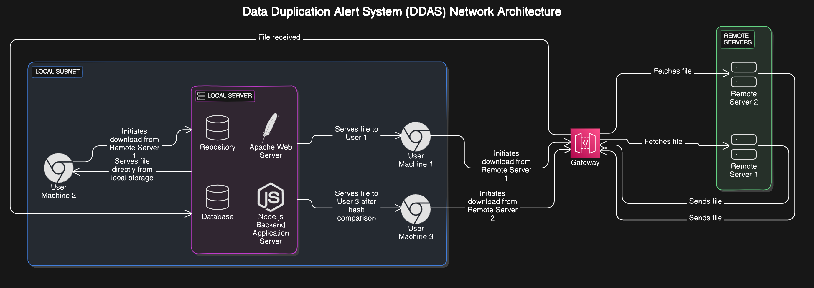

# **DDAS - Data Download Duplicate Alert System**

## **Goal** 

So the task here is to essentially make a **Data Download Duplicate Alert System**. This  should be helpful in an institute or an organization kind of an enviroment, where in there are many users and there are many potential duplicate dowbloads taking place. Being an Engineering student majoring in computer science, this absolutely makes sense as when we have to prepare an assignment for let's say traning some sort of model, all the students are essentially going to download the same dataset. This will burden the server of the dataset as well as the institute's own network. It could have been very well avoided since we are all in the same subnet (in the same local area network basically) and in some shape or form physially closer too.

## **Components of a Potential Solution**

Before diving into the solution, we define two high-level components that a potential solution must have:

1. **Duplicate Download Detection**: A mechanism to detect duplicate downloads and alert the user accordingly.

2. **Serving the File**: Now that the duplicate file has been detected, we will also want to serve the user the file from somewhere within the subnet as someone obviously already has it. Detection alone will serve no purpose as the user still needs the file and it has to be given it to him/her.



## **Solution**

Now we propose the solution to both the above tasks. The solution will contain first contain architecture details and then implementation level details (as in the tech stack etc).

### **1. Detecting Duplicate Downloads**

Let us for now say, that each of the computers in the subnet has some sort of daemon running in their computers (we will later in the implementation level detail see what and where this daemon can be). The daemon conatantly checks for downloads taking place in the system. Now the moment a download is detected, the daemon needs to somehow check whether this file has been previously downloaded or not and it has to do this in the context of the entire local network. That is to say, if any user (albeit on a different system but within the subnet) has downloaded it, it should be reported to the user. There are two things to be brought to light here now : 

#### **Key Challenges:**

- **Where to store download information?**
  - We can use a centralized database. This database will be on the local server (think of it like the admin system within the subnet). This centralized architecture will allow for a common view to all the users. It will be updated whenever a download takes place and will also allow for individual system to query in order to find out if the same dataset has been downloaded before.

- **How to declare a download as duplicate?**
  For one, we can take the following parameters to declare a file as duplicate 
-> **Filename**
-> **Url** (or ip address) of file

So if both the filename and the url of the file about to be downloaded match with a file already present in the database, we can declare it to be duplicate.

While this would be good enough, we can perhaps do better. These days a lot of commercial websites have come up (like kaggle ) which are a really good repository of datasets. Often users upload a dataset on multiple such platforms. If that is the case, then if one of the users downloads a dataset from say url 1 and then a second user downloads the same dataset from say url 2, then even though it is the same dataset, it will not be detected (since the url is different and further the file name may differ).

Hence for such cases, we need something more robust. We resort to **Hash** to deal with this issue.
Hash of a file will always be the same(no matter which website they are uploaded on). Moreover, the hash we will calculate will not include the metadata of the file. This means that even if the name of the file is different, the has will come out to be the same. Furthermore, hashing algorithms are really fast and require very less computational power. We hashed a 17 GB file and it only took 13 seconds using SHA256!!

#### **Final Detection Algorithm:**

```pseudo
On File Download Request:
  Input: Filename, URL, File Hash
  
Step 1: Check if Filename and URL exist in the database
    IF (Filename, URL) found in the database:
        RETURN "Duplicate File Detected"

Step 2: If no match found, search for the hash of the file
    IF (File hash) found in the database:
        RETURN "Duplicate File Detected from Different Source"
    ELSE:
        INSERT (Filename, URL, File Hash) into the database
        RETURN "New File Added"
```

This method helps detect both same-site and cross-site duplicate downloads.


* Single site duplicate detection



* Cross site duplicate detection



## 2. Serving Duplicate File

Alright, so the daemon and database are in place, but the system will never be complete if we don't provide a mechanism to also serve the user the duplicate file. Otherwise, the user will still have to download the file after receiving the alert. We could potentially give the user's private IP address, but this comes with several issues:

1. Private IP addresses are not linked to users and are subject to change.
2. It is not an elegant solution.
3. Users would still need to establish contact for the dataset exchange, which is not optimal.

So, once again, we turn to a **centralized repository** solution. The idea is that the first time a particular dataset is downloaded in the subnet (i.e., when no matching download details exist in the database), the user is given an option to download the dataset to the centralized repository (available on the local server within the subnet). If the user believes the file might be useful to others, they can choose this option, leading to a transfer of the file to the local repository. When the repository gets the entire file, it serves the file to the user.

When a second user requests the same file, the duplicate will be detected through the database entry, and the file will be served from the local repository. This solution reduces the burden on the remote server and the institute’s network while also speeding up downloads for subsequent users (since the download happens within the same subnet).

## Other Potential Architectures with Major Problems

1. **Distributed Solution**: Instead of having a centralized repository, we could use a distributed solution where each user hosts the files they first downloaded. This would prevent a single point of failure, but it introduces other major problems. First, it requires complex software on each computer to facilitate communication. Second, not all systems in an organization may always be active. If a system is inactive, a duplicate will not be detected, and the file will be downloaded again.

2. **Duplicate Detection from the Server Side**: This is obviously not feasible for several reasons. Even if the server could detect duplicates, it would still need to serve the files to the other user. Additionally, this solution is meant for institutes where users are behind a single public IP. In such cases, the server cannot distinguish between users, nor convey which user downloaded the file previously.

## Implementation Details

Here we dive into the implementation-level details of the proposed architecture. We have aimed for the most optimal solution.

### a. Daemon = Browser Extension

One of the most important parts of the solution is the daemon on each user system, monitoring downloads, blocking them, and gathering details. Perhaps the best fit for this daemon is a **browser extension**. It is resource-friendly (running only when the browser is active), easy to maintain, and simple for users (or admins) to install. Updates are also easily managed. The browser extension can gather download details from the browser’s API. For our prototype, we built a Chrome extension, given the popularity of the browser.

### b. Backend

The backend can be split into three parts:

1. **Backend API**: The API communicates with the Chrome extension and is built using **Express and Node.js**. This application server acts as a middleman between the database and the repository, coordinating all processes.
2. **Database**: We chose a document-based dataset for its flexibility, specifically **MongoDB** for its efficiency and large user community.
3. **Repository**: All of this runs on a **Linux-based operating system** on a local server within the subnet. The downloaded files are stored securely in a folder accessible to the backend server and database.

### c. Additional Components

- **Web server (for the local server)**: To provide services effectively, we use the **Apache web server**, a popular and easy-to-set-up choice for this purpose.
- **Hashing algorithm**: We use the **SHA256** algorithm for file verification.

---

### Technologies used in a nutshell

<p align="center">
  
  
  
  
  
  
  
  
  
  
  
  
  
</p>

---


* Overall Architecture is as shown below




## Other Considerations

We have also considered performance and security aspects for the DDAS architecture:

1. **LRU-Based File Deletion**: In large organizations, the volume of data downloaded to the local server can become huge. Over time, much of this data may become irrelevant, so storing it is not ideal. We propose a **Least Recently Used (LRU)** deletion policy, where files not accessed for a certain threshold of time are deleted.
   
2. **Antivirus**: Since the local repository downloads files first, it can act as a checkpoint where an antivirus scan is performed, enhancing security across the subnet.

## Other Features

### Statistics

Looking at the scenario where a user first downloads a file in the subnet, they should first consent if they want the file to be downloade through the local repository or not. While it is understandable that the user will not allow any personal files to be downloaded to the local repository, we need to make sure that the user is sensible enough to allow for dataset downloads to happen to the local repository for the overall good of the community. 

While organizations can instruct users to do the same, the users can really be motivated and incentivized by showing them statistics.
Our chrome extension page will also have a small table in one of the corners, displaying the amount of time and network bandwidth the users over the entire subnet have saved using the DDAS. This will give users the necessary incentive to allow for download to happen through the local repository for that first download and enough trust to download from the local repository from the second time onwards

### Chatbot


In today's time, it is hard to overlook the benefits that AI can give to any system. It should be used to the extent possible in a wise manner.Here in out DDAS solution, we have a potential use case creeping up for AI which we noticed and have tried to come up with an appropriate solution.

Pircture this,  you as a student or a researched in an institute want to download a dataset related to some classification task. You are not quite about the dataset to be used in your case or even if such a dataset exists. In such a case if you had the access to look at the database, it could be helpful to you. Since then you would get an idea of what other people are working or have worked with. The problem is that, giving the entire database visibility to each user might of not be much help, since 1. It could be very large and the user may find it cumbersome to search through it and 2. Not all datasets have names which reveal what they are made for

Hence in such a scenario, a LLM based chatbot could prove to be useful. The chatbot will be fed the details of all existing datasets in the database. With this, the chatbot will have thr knowledge of all that is available within the database. Additionally, since it was trained on the entire internetm it will also know the details and uses of each dataset.
Hence it will be ablt to provide the confused user with the necessary details.

We have made the chatbot using **Langchain** and an LLM (**gemini API** in this case). We have used **Streamlit** to build the application.
This chatbot is also hosted on the local server and it will be available to all the users within the subnet at a particular ip.
